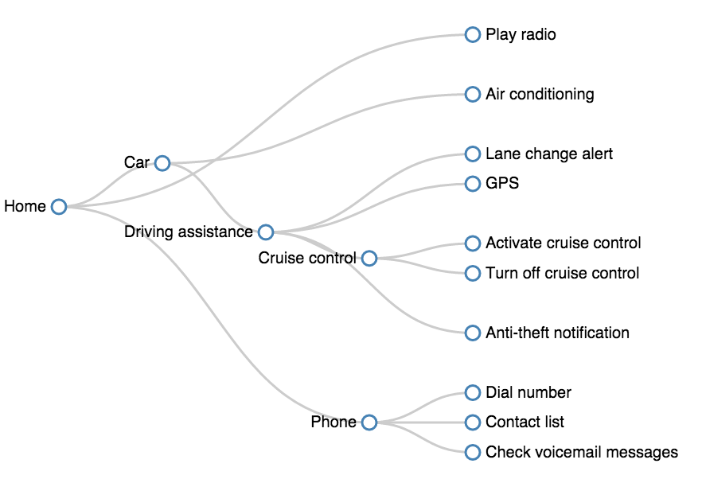
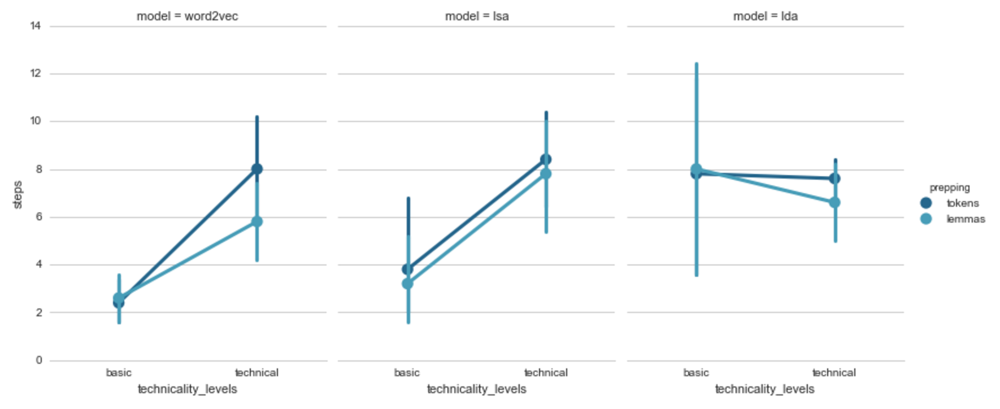

# Information scent analysis

This notebook **simulates** user exploration of graphical user interfaces (GUIs) through **semantic analysis of their menus and labels**. 

Users are assumed to navigate the menu architecture (aka **information architecture or IA**) of GUIs by **iteratively clicking on the feature label the most similar, semantically, to a goal**. While this "means-end analysis" strategy insures convergence to the goal, navigation errors occur, which practitioners (designers, information architects) typically assess during user tests. 

An alternative approach, called **infoscent**, is examined here that uses **semantic similarity models for predicting user navigation errors**. Previous infoscent tools (see [Cogtool IBM](http://researcher.watson.ibm.com/researcher/view_group.php?id=2238) aka [cognitive crash dummies](http://cogtool.com/publications/)) used Latent Sematic Analysis (LSA) language models for **simulating the similarity jusgments inherent to searching websites**.

Here, infoscent is generalized to simulating the semantic exploration of GUI materials, and **the original LSA approach is compared to 2 alternative language models**:
- **Latent Dirichlet Analysis (LDA)**
- **Word Vector Representation (Word2Vec)**

The 3 models (LSA, LDA, word2vec) are trained with plain English and lemmatized tokenizations.

<b> Example of the IA of an GUI (represented as a d3.js dendrogram): </b>

# Results

The LDA model performed poorly, probably because IA labels are too concise

**The original LSA model and the word2vec model perfom equally well**. However, **word2vec seems to better reflect the usage technical goals (= unfamiliar, advanced, etc.) make behavior more vicariant than basic usge goals** (cf. the SD for W2V on basic goals more realistic AND **better differentiated from technical goals than the SD for LSA**).

**Thus far, Word2vec seems to be a good challenger to previous LSA-based infoscent approaches.**
